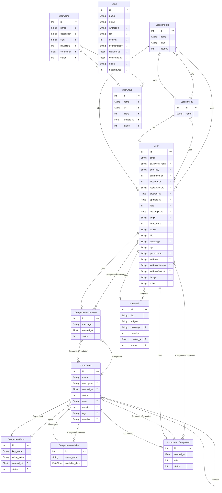

```mermaid
erDiagram

  "LocationState" {
    Int id "🗝️"
    String name 
    String state 
    Int country 
    }
  

  "LocationCity" {
    Int id "🗝️"
    String name 
    }
  

  "User" {
    Int id "🗝️"
    String email 
    String password_hash "❓"
    String auth_key "❓"
    Int confirmed_at "❓"
    Int blocked_at "❓"
    String registration_ip "❓"
    Float created_at "❓"
    Float updated_at "❓"
    Int flag "❓"
    Float last_login_at "❓"
    String origin "❓"
    Int num_turma "❓"
    String name 
    String bio "❓"
    String whatsapp "❓"
    String cpf "❓"
    String postalCode "❓"
    String address "❓"
    String addressNumber "❓"
    String addressDistrict "❓"
    String image "❓"
    String roles "❓"
    }
  

  "Component" {
    Int id "🗝️"
    String name 
    String description "❓"
    Float created_at "❓"
    Int status 
    String order "❓"
    Int duration "❓"
    String tags "❓"
    String orderby "❓"
    }
  

  "ComponentExtra" {
    Int id "🗝️"
    String key_extra 
    String value_extra 
    Float created_at "❓"
    Int status "❓"
    }
  

  "ComponentAvailable" {
    Int id "🗝️"
    String turma_num 
    DateTime available_date 
    }
  

  "ComponentAnnotation" {
    Int id "🗝️"
    String message 
    Float created_at 
    Int status 
    }
  

  "ComponentCompleted" {
    Int id "🗝️"
    Float created_at 
    Int rate 
    Int status 
    }
  

  "Lead" {
    Int id "🗝️"
    String name 
    String email 
    String whatsapp "❓"
    String list "❓"
    Int confirm "❓"
    String segmentacao "❓"
    Float created_at "❓"
    Float confirmed_at "❓"
    String origin "❓"
    Int naoperturbe "❓"
    }
  

  "MassMail" {
    Int id "🗝️"
    String list 
    String subject 
    String message "❓"
    Int quantity 
    Float created_at "❓"
    Int status "❓"
    }
  

  "WppCamp" {
    Int id "🗝️"
    String name "❓"
    String description "❓"
    String slug "❓"
    Int maxclicks "❓"
    Float created_at "❓"
    Int status "❓"
    }
  

  "WppGroup" {
    Int id "🗝️"
    String name "❓"
    String url "❓"
    Int clicks "❓"
    Float created_at "❓"
    Int status "❓"
    }
  
    "LocationState" o{--}o "LocationCity" : "City"
    "LocationState" o{--}o "User" : "User"
    "LocationCity" o|--|o "LocationState" : "state"
    "LocationCity" o{--}o "User" : "User"
    "User" o|--|o "LocationCity" : "city"
    "User" o|--|o "LocationState" : "state"
    "User" o{--}o "ComponentAnnotation" : "ComponentAnnotation"
    "User" o{--}o "ComponentCompleted" : "ComponentCompleted"
    "User" o{--}o "MassMail" : "MassMail"
    "Component" o|--|o "Component" : "parent"
    "Component" o{--}o "Component" : "children"
    "Component" o{--}o "ComponentAnnotation" : "ComponentAnnotation"
    "Component" o{--}o "ComponentCompleted" : "ComponentCompleted"
    "Component" o{--}o "ComponentAvailable" : "ComponentAvailable"
    "Component" o{--}o "ComponentExtra" : "extras"
    "ComponentExtra" o|--|o "Component" : "Component"
    "ComponentAvailable" o|--|o "Component" : "Component"
    "ComponentAnnotation" o|--|| "User" : "User"
    "ComponentAnnotation" o|--|o "Component" : "Component"
    "ComponentCompleted" o|--|| "User" : "User"
    "ComponentCompleted" o|--|o "Component" : "Component"
    "MassMail" o|--|o "User" : "User"
    "WppCamp" o{--}o "WppGroup" : "wppgroup"
    "WppGroup" o|--|o "WppCamp" : "wppcamp"
```
